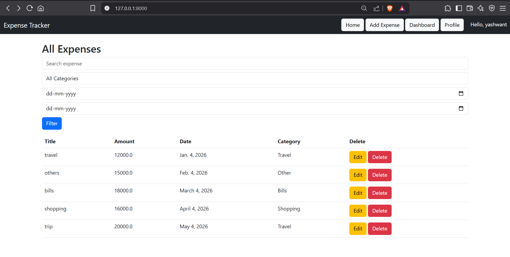
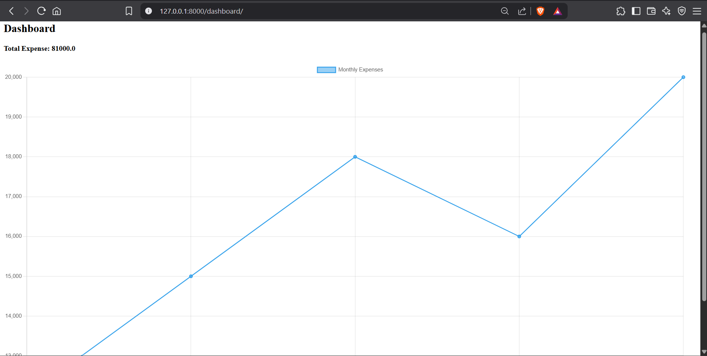

# Expense Tracker (Django)

A full-stack Expense Tracker web application built using Django.

## Features
- User Authentication (Login/Register/Logout)
- Add, Edit, Delete Expenses
- Dashboard with Monthly Chart
- Category & Date Filters
- Search Functionality
- Export to CSV
- Multi-user Support

##  Tech Stack
- Python
- Django
- SQLite
- Bootstrap
- Chart.js

##  Screenshots




##  Setup

```bash
git clone https://github.com/your-username/expense-tracker-app.git
cd expense-tracker-app
pip install -r requirements.txt
python manage.py migrate
python manage.py runserver
